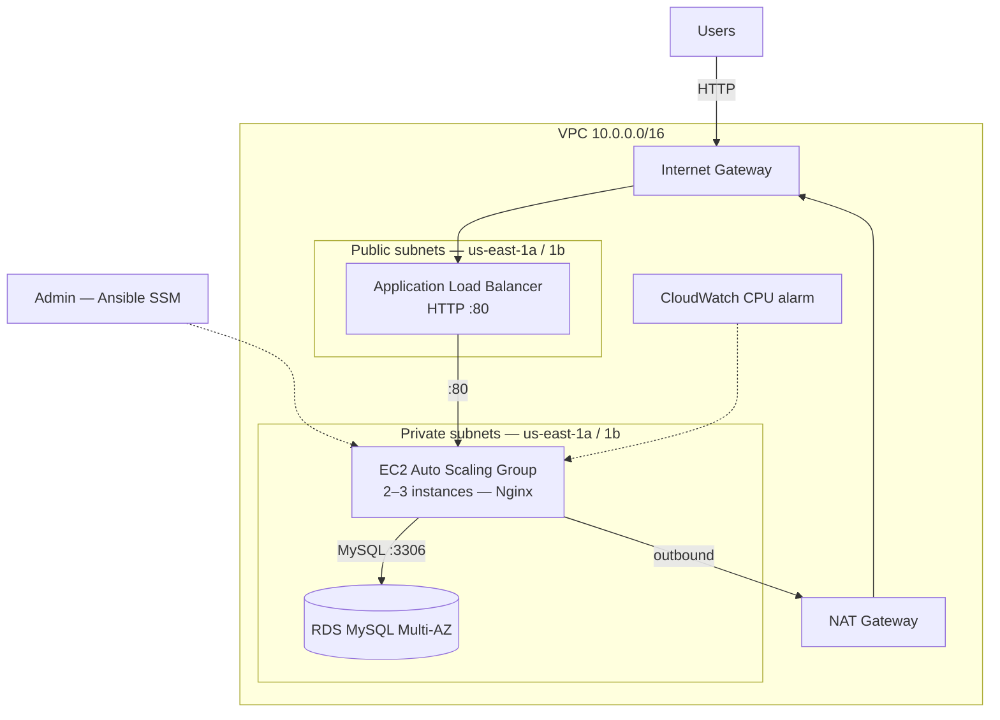

# AWS High Availability Architecture

**Author:** José Martinez | Arkhadia by GHC

---

## Introduction

This project deploys a **High Availability (HA)** architecture on **Amazon Web Services (AWS)** using:

- **Terraform** for Infrastructure as Code (IaC)
- **Ansible** for provisioning and server configuration (via **AWS Systems Manager**)

The goal is a secure, scalable, and reproducible environment aligned with enterprise-style practices.

---

## Objectives

- Deploy a highly available and secure cloud architecture
- Automate infrastructure and application configuration
- Separate application and database tiers
- Configure monitoring and alerts with Amazon CloudWatch

---

## Services Used

| Service | Role |
|---------|------|
| Amazon VPC | Custom VPC, public/private subnets, IGW, NAT |
| EC2 Auto Scaling | Launch template, ASG (private subnets) |
| Application Load Balancer | HTTP traffic to the web tier |
| Amazon RDS (MySQL) | Multi-AZ database in private subnets |
| Amazon CloudWatch | CPU alarms for the ASG |
| IAM | Instance profile (SSM + CloudWatch agent) |
| Ansible + SSM | Nginx and bootstrap without SSH |

---

## Architecture

Full diagrams (networking, security groups, traffic, deployment): **[docs/architecture.md](docs/architecture.md)**



- **VPC CIDR:** `10.0.0.0/16`
- **Subnets:** 2 public + 2 private (`us-east-1a`, `us-east-1b`)
- **Web tier:** Private subnets; HTTP only from ALB security group
- **Database:** RDS ingress only from EC2 security group (port 3306)

---

## Repository Layout

```
AWS-HA-CS1/
├── docs/
│   └── architecture.md  # Mermaid diagrams (detailed)
└── aws/ha-arch/
    ├── terraform/
    │   ├── main.tf
    │   ├── modules/vpc/
    │   ├── modules/ec2/    # ASG, ALB, launch template, IAM
    │   └── modules/rds/
    └── ansible/
        ├── inventory/hosts.ini
        ├── playbooks/bootstrap-python.yml
        ├── playbooks/webserver.yml
        └── requirements.txt
```

---

## Prerequisites

- AWS CLI configured with appropriate credentials
- Terraform >= 1.5
- Python 3 + Ansible (see `ansible/requirements.txt`)
- Existing EC2 key pair in the target region
- S3 bucket for Ansible SSM (`ark-ansible-tmp` or update `ansible.cfg` / inventory)

---

## Deployment

### 1. Terraform

```bash
cd aws/ha-arch/terraform
cp terraform.tfvars.example terraform.tfvars
# Edit terraform.tfvars (key_name, project, etc.)

export TF_VAR_db_username='admin'
export TF_VAR_db_password='your-secure-password'

terraform init
terraform plan
terraform apply
```

Note outputs: `alb_dns_name`, `asg_name`, `vpc_id`.

### 2. Ansible

```bash
cd aws/ha-arch/ansible
python3 -m venv .venv && source .venv/bin/activate
pip install -r requirements.txt

# Add instance IDs to inventory/hosts.ini (from ASG/EC2 console or CLI)
ansible-playbook playbooks/bootstrap-python.yml
ansible-playbook playbooks/webserver.yml
```

### 3. Verify

- Open `http://<alb_dns_name>` in a browser (custom Nginx page)
- Test RDS from an instance: `mysql -h <rds_endpoint> -u admin -p`

---

## Terraform Modules

| Module | Responsibility |
|--------|----------------|
| `vpc` | VPC, subnets, IGW, NAT, routing |
| `ec2` | IAM (SSM), ALB, target group, ASG, launch template |
| `rds` | Subnet group, RDS MySQL, DB security group |

Root `cloudwatch.tf` defines a high-CPU alarm on the ASG.

---

## Security Notes

- Do **not** commit `terraform.tfvars`, `*.tfstate`, or passwords.
- Use `TF_VAR_db_password` (or AWS Secrets Manager) for database credentials.
- **Rotate** any password that was previously committed to git history.
- EC2 instances accept HTTP **only** from the ALB security group.

---

## Issues Encountered (historical)

| Issue | Solution |
|-------|----------|
| Amazon Linux 2023 lacks Python | Ansible bootstrap playbook + user_data |
| Apt vs dnf | Use `dnf` on AL2023 |
| `www-data` vs `nginx` user | Use `nginx` ownership in templates |
| Double-encoded user_data | Single `base64encode` in launch template |
| RDS wired to hardcoded subnet IDs | Use `module.vpc` outputs |

---

## Contact

- jmartinez@arkhadia.net
- [@genialcorpholding](https://github.com/genialcorpholding)
