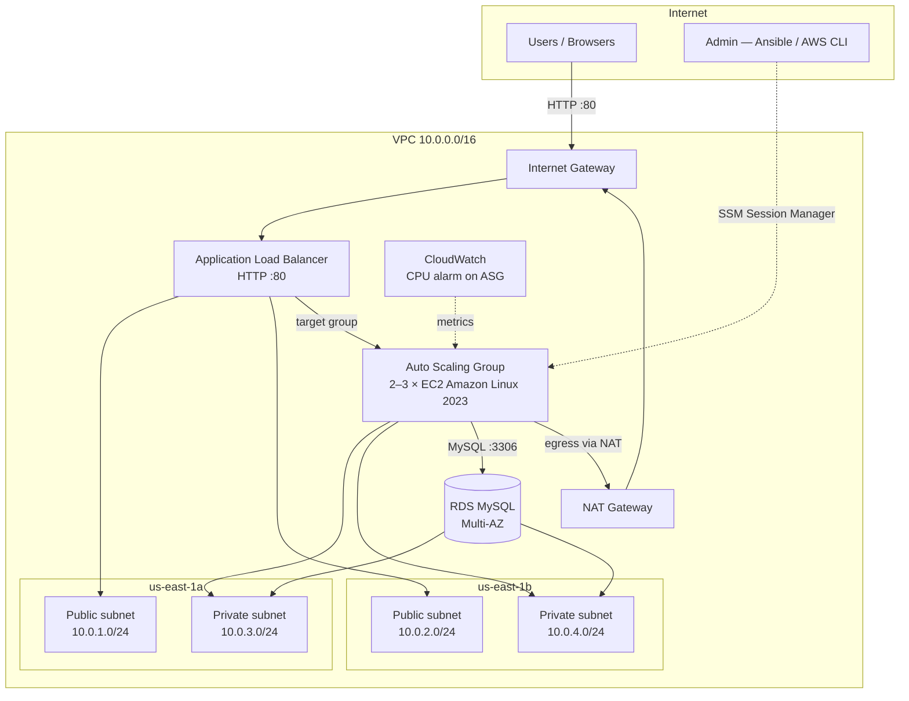
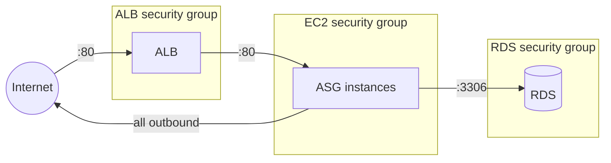
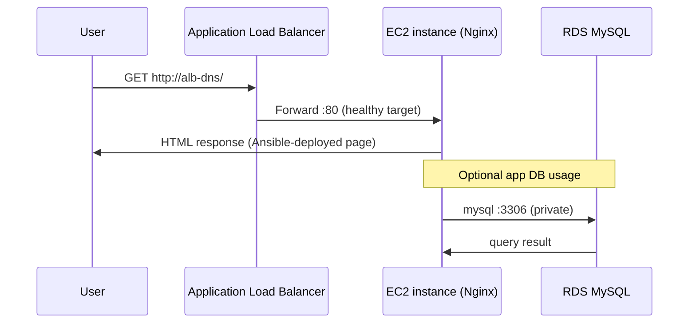
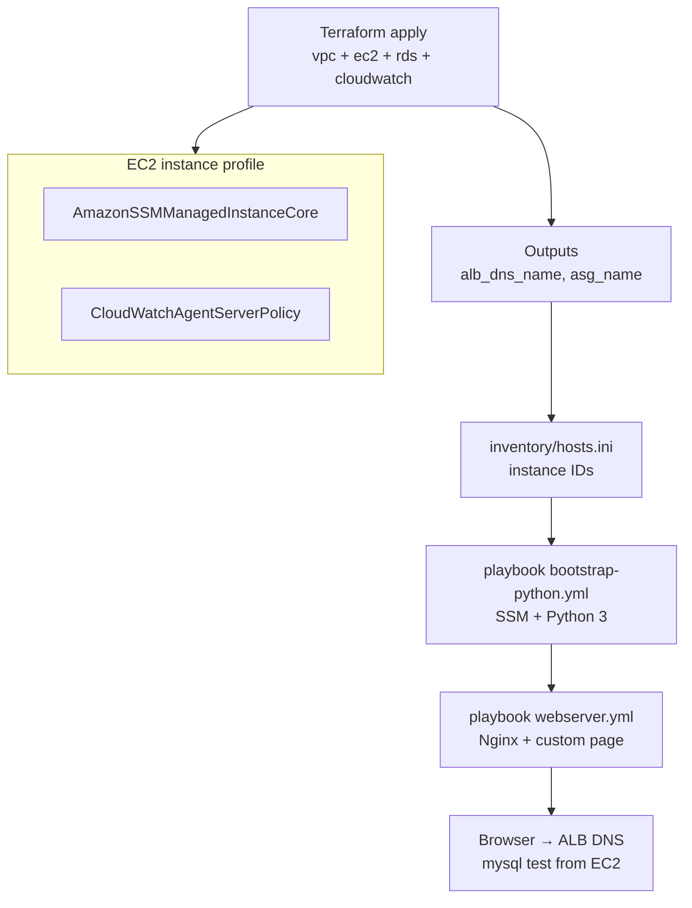
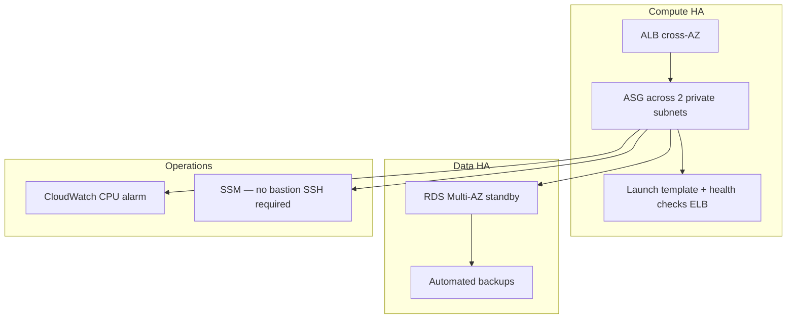
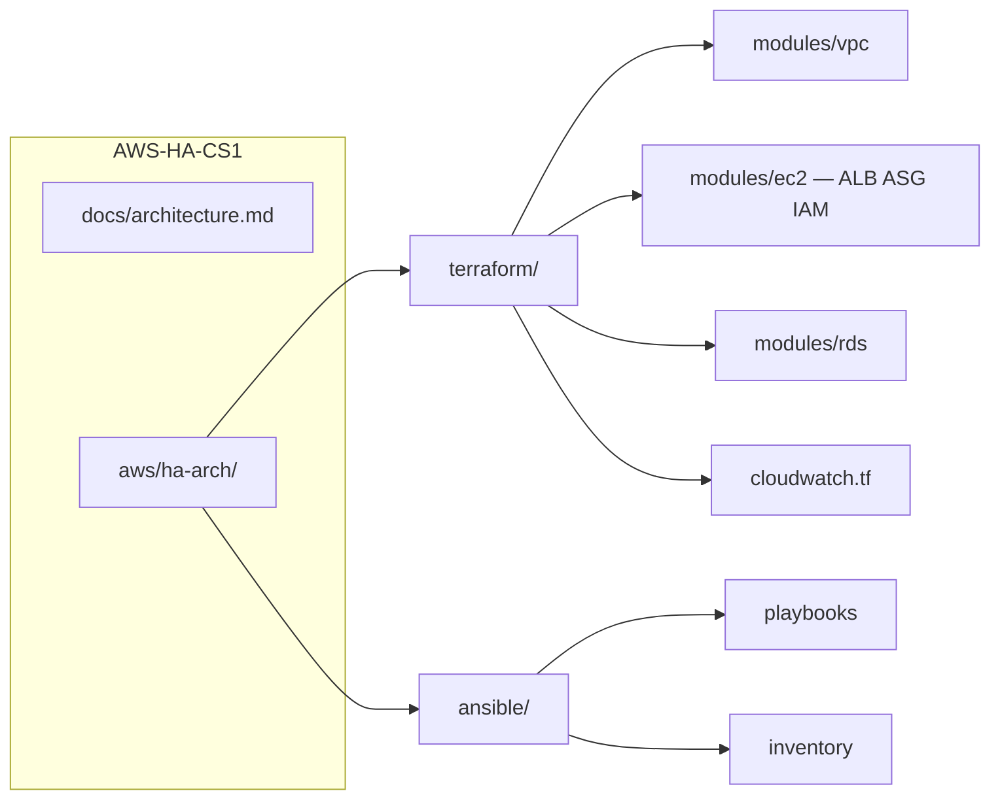

# Architecture diagrams

Visual reference for the **AWS-HA-CS1** lab: VPC networking, load-balanced web tier, Multi-AZ RDS, monitoring, and Ansible over SSM.

---

## AWS infrastructure (Terraform)

| Component | Placement | Notes |
|-----------|-----------|--------|
| ALB | Public subnets (multi-AZ) | Internet-facing HTTP |
| EC2 ASG | Private subnets | `min=2`, `max=3`, `desired=2` |
| RDS | Private subnets | MySQL 8, Multi-AZ optional |
| NAT | Public subnet AZ-a | Outbound from private tier |
| CloudWatch | Regional | High CPU alarm on ASG |

---

## Security groups

- **EC2** accepts HTTP **only** from the ALB security group (not from the open internet).
- **RDS** accepts MySQL **only** from the EC2 security group.
- **Admin access** to instances is via **SSM** (IAM instance profile), not SSH from `0.0.0.0/0`.

---

## Request flow (web traffic)

---

## Provisioning & operations

**User data** (launch template): installs `python3` and `amazon-ssm-agent` for Ansible connectivity.

---

## High availability characteristics

---

## Repository map

---

## Related paths

| Path | Content |
|------|---------|
| [README.md](../README.md) | Deployment quick start |
| `aws/ha-arch/terraform/` | Infrastructure modules |
| `aws/ha-arch/ansible/` | SSM-based configuration |
